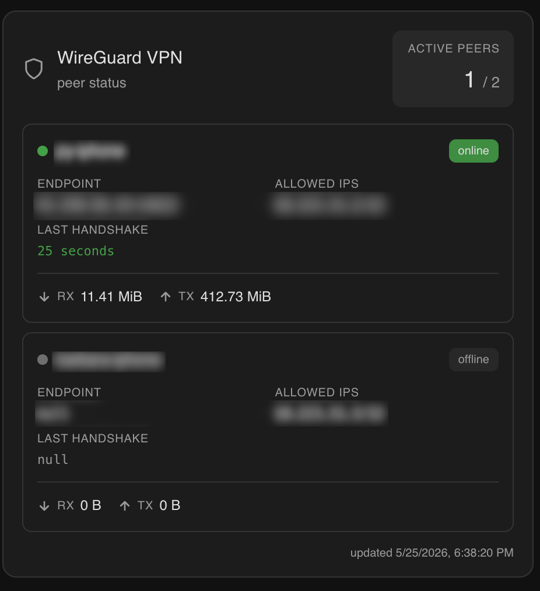

# WireGuard Karte

[English](README.md) · [Português](README.pt.md) · [Español](README.es.md) · [Français](README.fr.md) · **Deutsch**

Eine saubere, minimalistische Lovelace-Karte für [Home Assistant](https://www.home-assistant.io/), die den Status der WireGuard-VPN-Peers anzeigt — Verbindungsstatus, Endpunkte, Übertragungsstatistiken und Zeit des letzten Handshakes — in Echtzeit aktualisiert über einen REST-Sensor.

---

## Vorschau




| Peer online | Peer offline |
|---|---|
| Grüner Punkt · `online`-Plakette · Handshake in Sekunden | Grauer Punkt · `offline`-Plakette · Handshake in Stunden |

Jede Peer-Karte zeigt:
- **Verbindungsstatus** — farbcodierter Punkt und Plakette
- **Endpunkt** — öffentliche IP und Port
- **Erlaubte IPs** — Tunneladresse des Peers
- **Letzter Handshake** — in lesbarer Form, grün hervorgehoben wenn aktuell
- **Übertragungsstatistiken** — rx / tx in lesbaren Einheiten

---

## Voraussetzungen

| Voraussetzung | Hinweise |
|---|---|
| Home Assistant | 2023.x oder höher |
| Ein WireGuard-API-Endpunkt | Muss das unten beschriebene JSON-Format bereitstellen — Einrichtungsanleitung weiter unten |
| HACS | Nur für die HACS-Installationsmethode erforderlich |

---

## Installation

### Option A — HACS (empfohlen)

1. Öffnen Sie HACS in der HA-Seitenleiste
2. Gehen Sie zu **Frontend**
3. Klicken Sie auf **⋮ → Benutzerdefinierte Repositories**
4. Fügen Sie die URL dieses Repositories hinzu und wählen Sie die Kategorie **Lovelace**
5. Klicken Sie auf **Herunterladen**
6. Aktualisieren Sie den Browser hart (`Ctrl+Shift+R`)

### Option B — Manuell

1. Laden Sie `wireguard-card.js` aus dem [neuesten Release](../../releases/latest) herunter
2. Kopieren Sie es nach `/config/www/wireguard-card.js`
3. Gehen Sie zu **Einstellungen → Dashboards → ⋮ → Ressourcen → Ressource hinzufügen**
   - URL: `/local/wireguard-card.js`
   - Typ: `JavaScript-Modul`
4. Aktualisieren Sie den Browser hart (`Ctrl+Shift+R`)

---

## API

Diese Karte liest von einem REST-Sensor, der einen JSON-Endpunkt abfragt. Der Endpunkt muss folgende Struktur zurückgeben:

```json
{
  "active_peers": 1,
  "total_peers": 2,
  "peers": {
    "peer-name": {
      "friendly_name": "peer-name",
      "endpoint": "1.2.3.4:51820",
      "allowed_ips": "10.0.0.2/32",
      "latest_handshake": "21 seconds",
      "transfer_rx_human": "3.21 MiB",
      "transfer_tx_human": "137.18 MiB",
      "connected": true
    }
  },
  "updated_at": "2026-05-20T22:55:00.281068+00:00"
}
```

### Felder auf oberster Ebene

| Feld | Erforderlich | Hinweise |
|---|---|---|
| `peers` | ✅ | Objekt mit Peer-Namen als Schlüsseln. Die Karte iteriert über dessen Werte |
| `active_peers` | — | Wird in der Header-Statistik angezeigt. Greift auf den Sensorstatus zurück, wenn weggelassen |
| `total_peers` | — | Wird neben `active_peers` angezeigt. Greift auf die Anzahl der Einträge in `peers` zurück, wenn weggelassen |
| `updated_at` | — | ISO-Zeitstempel im Footer. Der Footer wird ausgeblendet, wenn weggelassen |

### Felder pro Peer

| Feld | Erforderlich | Hinweise |
|---|---|---|
| `friendly_name` | ✅ | Wird als Peer-Titel angezeigt |
| `endpoint` | ✅ | Wird unverändert angezeigt (z. B. `1.2.3.4:51820`) |
| `allowed_ips` | ✅ | Wird unverändert angezeigt (z. B. `10.0.0.2/32`) |
| `latest_handshake` | ✅ | Wird unverändert angezeigt — formatieren Sie ihn beliebig auf API-Seite |
| `transfer_rx_human` | ✅ | Wird unverändert angezeigt (z. B. `3.21 MiB`) |
| `transfer_tx_human` | ✅ | Wird unverändert angezeigt (z. B. `137.18 MiB`) |
| `connected` | ✅ | Boolean. Steuert den Online/Offline-Indikator und den `connected_only`-Filter |

Zusätzliche Felder, die Ihre API zurückgibt (rohe Byte-Zähler, „Sekunden her"-Ganzzahlen, öffentliche Schlüssel usw.), werden von der Karte einfach ignoriert.


## Einrichtung des WireGuard-Statistik-API-Dienstes

Folgen Sie diesen Schritten, um eine einfache JSON-API für den WireGuard-Status einzurichten, die sich mit Home Assistant integriert.

### 1. API-Skript erstellen

Erstellen Sie das API-Skript mit Ihrem bevorzugten Editor:

```bash
sudo nano /usr/local/bin/wg-stats.py
```

Ein Beispielskript finden Sie unter [`src/wg-stats.py`](src/wg-stats.py).  
Passen Sie es bei Bedarf an Ihre Umgebung an.

### 2. Skript ausführbar machen

```bash
sudo chmod +x /usr/local/bin/wg-stats.py
```

### 3. systemd-Dienst erstellen

Richten Sie einen Dienst ein, der Ihr Skript automatisch ausführt:

```bash
sudo nano /etc/systemd/system/wg-stats.service
```

Eine Beispiel-[`wg-stats.service`](src/wg-stats.service) ist in diesem Repository als Referenz verfügbar.  
Achten Sie darauf, `ExecStart` zu aktualisieren, falls Ihr Python-Pfad anders ist.

### 4. systemd neu laden

Laden Sie systemd neu, damit es den neuen Dienst erkennt:

```bash
sudo systemctl daemon-reload
```

### 5. Dienst beim Start aktivieren

Aktivieren Sie den Dienst, sodass er beim Systemstart läuft:

```bash
sudo systemctl enable wg-stats
```

### 6. Dienst starten

Starten Sie den WireGuard-Statistikdienst sofort:

```bash
sudo systemctl start wg-stats
```

### 7. Überprüfen, dass alles funktioniert

Prüfen Sie den Dienststatus:

```bash
sudo systemctl status wg-stats
```

Sie sollten sehen, dass der Dienst aktiv (läuft) ist.  
Wenn ja, ist Ihr API-Endpunkt jetzt bereit, von Home Assistant verwendet zu werden.

> ⚠️ **Sicherheitshinweis:** Das Beispiel-`wg-stats.py` lauscht auf `0.0.0.0:8888` **ohne Authentifizierung und ohne TLS**, sodass jeder Host im selben Netzwerk Ihre WireGuard-Topologie auslesen kann — Peer-Namen, Endpunkte, erlaubte IPs und Transferstatistiken. Bevor Sie es freigeben, sollten Sie eine oder mehrere der folgenden Optionen in Betracht ziehen:
> - Binden Sie es an eine bestimmte Schnittstelle (ändern Sie z. B. die Lausch-Adresse von `0.0.0.0` auf `127.0.0.1` oder Ihre reine LAN-IP), damit es aus nicht vertrauenswürdigen Netzwerken nicht erreichbar ist.
> - Beschränken Sie den Zugriff mit einer Firewall-Regel, die nur Ihren Home-Assistant-Host zulässt.
> - Geben Sie Port `8888` niemals direkt ins Internet frei. Falls Fernzugriff nötig ist, stellen Sie ihn hinter einen Reverse-Proxy mit Authentifizierung/TLS oder greifen Sie über das VPN selbst darauf zu.

---

## Sensor-Konfiguration

Fügen Sie Folgendes zu Ihrer `configuration.yaml` hinzu:

```yaml
sensor:
  - platform: rest
    name: vpn_stats
    unique_id: wireguard_vpn_stats
    resource: http://<ihr-api-host>:<port>
    scan_interval: 10
    value_template: "{{ value_json.active_peers }}"
    unit_of_measurement: peers
    json_attributes:
      - active_peers
      - total_peers
      - peers
      - updated_at
```

Ersetzen Sie `<ihr-api-host>:<port>` durch die Adresse Ihrer WireGuard-API.

| Feld | Beschreibung |
|---|---|
| `unique_id` | Ermöglicht die Verwaltung der Entität über die UI |
| `scan_interval` | Abfragefrequenz in Sekunden — 10 ist ein vernünftiger Standardwert |
| `value_template` | Setzt den Sensorstatus auf die Anzahl der aktiven Peers |
| `unit_of_measurement` | Beschriftet den Statuswert in Verlauf und Logbuch |
| `json_attributes` | Holt verschachtelte Daten als Entitätsattribute, damit die Karte sie lesen kann |

Nach dem Bearbeiten der `configuration.yaml` laden Sie Ihre HA-Konfiguration neu (**Entwicklerwerkzeuge → YAML → Gesamtes YAML neu laden**) oder starten Sie Home Assistant neu.

---

## Karten-Konfiguration

Fügen Sie die Karte zu einem beliebigen Lovelace-Dashboard hinzu:

```yaml
type: custom:wireguard-card
entity: sensor.vpn_stats
```

Beim Hinzufügen der Karte über die Kartenauswahl wird die erste `sensor.*`-Entität, deren ID `vpn` enthält, vorausgewählt — meist `sensor.vpn_stats` — sodass Sie oft ohne Änderungen bestätigen können.

### Optionen

| Option | Erforderlich | Standard | Beschreibung |
|---|---|---|---|
| `entity` | ✅ | — | Die oben erstellte `sensor.vpn_stats`-Entität |
| `title` | — | _lokalisiert_ `"WireGuard VPN"` | Eigener Text als Titel im Kartenkopf. Wird er weggelassen, wird der lokalisierte Standard verwendet |
| `connected_only` | — | `false` | Bei `true` werden Peers ausgeblendet, deren `connected`-Feld nicht `true` ist; es bleiben nur die aktuell verbundenen übrig |
| `language` | — | _Home-Assistant-Benutzersprache_ | Erzwingt die UI-Sprache der Karte. Siehe [Sprachen](#sprachen) für unterstützte Werte. Wird sie weggelassen, nutzt die Karte die Home-Assistant-Benutzersprache und fällt auf Englisch zurück, wenn nicht unterstützt |

Beispiel mit eigenem Titel, ausgeblendeten Offline-Peers und auf Portugiesisch erzwungener UI:

```yaml
type: custom:wireguard-card
entity: sensor.vpn_stats
title: Heim-VPN
connected_only: true
language: pt
```

### Visueller Editor

Die Karte bringt einen visuellen Editor mit, sodass Sie sie direkt über die Dashboard-UI konfigurieren können, ohne YAML anzufassen:

- **Sensor-Entität** — Dropdown zur Auswahl der `sensor.vpn_stats`-Entität
- **Kartentitel** — optionales Textfeld zum Überschreiben des Header-Titels; leer lassen, um den lokalisierten Standard zu verwenden
- **Nur verbundene** — Schalter, um Offline-Peers aus der Karte auszublenden
- **Sprache** — Dropdown zum Überschreiben der Kartensprache; Standard: `Automatisch (Home Assistant Sprache)`

### Sprachen

Die Karte übersetzt ihre Beschriftungen derzeit in folgende Sprachen:

| Code | Sprache |
|---|---|
| `en` | English (Standard-Fallback) |
| `pt` | Português |
| `es` | Español |
| `fr` | Français |
| `de` | Deutsch |

Verhalten:

- Wenn `language` in der Kartenkonfiguration gesetzt ist und einem der obigen Codes entspricht, wird diese Sprache verwendet.
- Andernfalls liest die Karte `hass.locale.language` (die Home-Assistant-Benutzersprache). Regionssuffixe wie `pt-BR` oder `en-US` werden auf ihre Basissprache reduziert (`pt`, `en`).
- Wenn die aufgelöste Sprache nicht in der obigen Liste ist, fällt die Karte auf Englisch zurück.
- Der Footer-Zeitstempel wird ebenfalls mit `toLocaleString(language)` formatiert, sodass das Datums-/Zeitformat der aufgelösten Sprache folgt.

> Die Strings `latest_handshake`, `transfer_rx_human` und `transfer_tx_human` kommen unverändert von der API. Um sie in Ihrer Sprache zu erhalten, müssen Sie sie in Ihrem `wg-stats.py`-Dienst (oder Äquivalent) lokalisieren.

---

## Fehlerbehebung

**Karte zeigt „Entity not found"**
→ Prüfen Sie, ob der Sensor geladen ist und die Entitäts-ID exakt übereinstimmt (standardmäßig `sensor.vpn_stats`).

**Peers werden nicht angezeigt**
→ Bestätigen Sie, dass `peers` unter `json_attributes` in der Sensorkonfiguration aufgeführt ist und die API ein gültiges JSON-Objekt unter diesem Schlüssel zurückgibt.

**Daten sind veraltet**
→ Prüfen Sie den `updated_at`-Zeitstempel unten an der Karte. Wenn er sich nicht aktualisiert, prüfen Sie, ob die API von HA aus erreichbar ist und `scan_interval` gesetzt ist.

**Karte erscheint nicht in der Kartenauswahl**
→ Stellen Sie sicher, dass die Ressource korrekt hinzugefügt wurde und Sie einen harten Refresh (`Ctrl+Shift+R`) durchgeführt haben.

---

## Mitwirken

Pull Requests sind willkommen. Bitte öffnen Sie zuerst ein Issue für größere Änderungen.
