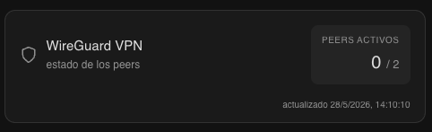

# Home Assistant Tarjeta WireGuard

[English](README.md) · [Português](README.pt.md) · **Español** · [Français](README.fr.md) · [Deutsch](README.de.md)

Una tarjeta Lovelace limpia y minimalista para [Home Assistant](https://www.home-assistant.io/) que muestra el estado de los peers de WireGuard VPN — estado de la conexión, endpoints, estadísticas de transferencia y hora del último handshake — actualizado en tiempo real desde un sensor REST.

---

## Vista previa




| Peer en línea | Peer desconectado |
|---|---|
| Punto verde · etiqueta `online` · handshake en segundos | Punto gris · etiqueta `offline` · handshake en horas |

Cada tarjeta de peer muestra:
- **Estado de conexión** — punto y etiqueta con código de color
- **Endpoint** — IP pública y puerto
- **IPs permitidas** — la dirección del túnel del peer
- **Último handshake** — en formato legible, resaltado en verde cuando es reciente
- **Estadísticas de transferencia** — rx / tx en unidades legibles

---

## Requisitos

| Requisito | Notas |
|---|---|
| Home Assistant | 2023.x o posterior |
| Un endpoint de la API de WireGuard | Debe exponer el formato JSON descrito abajo — instrucciones de configuración más adelante |
| HACS | Solo necesario para el método de instalación con HACS |

---

## Instalación

### Opción A — HACS (recomendado)

1. Abre HACS en la barra lateral de HA
2. Ve a **Frontend**
3. Haz clic en **⋮ → Repositorios personalizados**
4. Añade la URL de este repositorio y selecciona la categoría **Lovelace**
5. Haz clic en **Descargar**
6. Recarga el navegador con un refresh forzado (`Ctrl+Shift+R`)

### Opción B — Manual

1. Descarga `wireguard-card.js` desde la [última versión](../../releases/latest)
2. Cópialo a `/config/www/wireguard-card.js`
3. Ve a **Ajustes → Paneles → ⋮ → Recursos → Añadir recurso**
   - URL: `/local/wireguard-card.js`
   - Tipo: `Módulo JavaScript`
4. Recarga el navegador con un refresh forzado (`Ctrl+Shift+R`)

---

## API

Esta tarjeta lee desde un sensor REST que consulta un endpoint JSON. El endpoint debe devolver la siguiente estructura:

```json
{
  "active_peers": 1,
  "total_peers": 2,
  "peers": {
    "peer-name": {
      "friendly_name": "peer-name",
      "endpoint": "1.2.3.4:51820",
      "allowed_ips": "10.0.0.2/32",
      "latest_handshake": "21 seconds",
      "transfer_rx_human": "3.21 MiB",
      "transfer_tx_human": "137.18 MiB",
      "connected": true
    }
  },
  "updated_at": "2026-05-20T22:55:00.281068+00:00"
}
```

### Campos de nivel superior

| Campo | Obligatorio | Notas |
|---|---|---|
| `peers` | ✅ | Objeto indexado por nombre de peer. La tarjeta itera sobre sus valores |
| `active_peers` | — | Mostrado en la estadística del encabezado. Recurre al estado del sensor si se omite |
| `total_peers` | — | Mostrado junto a `active_peers`. Recurre al número de entradas en `peers` si se omite |
| `updated_at` | — | Timestamp ISO mostrado en el pie. El pie se oculta si se omite |

### Campos por peer

| Campo | Obligatorio | Notas |
|---|---|---|
| `friendly_name` | ✅ | Mostrado como el título del peer |
| `endpoint` | ✅ | Mostrado tal cual (p. ej. `1.2.3.4:51820`) |
| `allowed_ips` | ✅ | Mostrado tal cual (p. ej. `10.0.0.2/32`) |
| `latest_handshake` | ✅ | Mostrado tal cual, así que formátealo como prefieras desde la API |
| `transfer_rx_human` | ✅ | Mostrado tal cual (p. ej. `3.21 MiB`) |
| `transfer_tx_human` | ✅ | Mostrado tal cual (p. ej. `137.18 MiB`) |
| `connected` | ✅ | Booleano. Controla el indicador en línea/desconectado y el filtro `connected_only` |

Cualquier campo extra que tu API devuelva (contadores de bytes en bruto, enteros de "segundos atrás", claves públicas, etc.) es simplemente ignorado por la tarjeta.


## Configurar el servicio de la API de estadísticas de WireGuard

Sigue estos pasos para configurar una API JSON sencilla para el estado de WireGuard que se integre con Home Assistant.

### 1. Crear el script de la API

Crea el script de la API con tu editor preferido:

```bash
sudo nano /usr/local/bin/wg-stats.py
```

Puedes encontrar un script de ejemplo en [`src/wg-stats.py`](src/wg-stats.py).  
Modifícalo según sea necesario para tu entorno.

### 2. Hacer el script ejecutable

```bash
sudo chmod +x /usr/local/bin/wg-stats.py
```

### 3. Crear un servicio systemd

Configura un servicio para ejecutar tu script automáticamente:

```bash
sudo nano /etc/systemd/system/wg-stats.service
```

Ejemplo de [`wg-stats.service`](src/wg-stats.service) disponible en este repositorio como referencia.  
Asegúrate de actualizar `ExecStart` si tu ruta de Python es diferente.

### 4. Recargar systemd

Recarga systemd para que detecte el nuevo servicio:

```bash
sudo systemctl daemon-reload
```

### 5. Habilitar el servicio en el arranque

Habilita el servicio para que se inicie automáticamente:

```bash
sudo systemctl enable wg-stats
```

### 6. Iniciar el servicio

Inicia inmediatamente el servicio de estadísticas de WireGuard:

```bash
sudo systemctl start wg-stats
```

### 7. Comprobar que todo funciona

Verifica el estado del servicio:

```bash
sudo systemctl status wg-stats
```

Deberías ver que el servicio está activo (corriendo).  
Si es así, tu endpoint de API ya está listo para ser usado por Home Assistant.

> ⚠️ **Nota de seguridad:** El `wg-stats.py` de ejemplo escucha en `0.0.0.0:8888` **sin autenticación ni TLS**, por lo que cualquier host en la misma red puede leer la topología de tu WireGuard — nombres de los peers, endpoints, IPs permitidas y estadísticas de transferencia. Antes de exponerlo, considera una o varias de las siguientes opciones:
> - Vincúlalo a una interfaz específica (por ejemplo, cambia la dirección de escucha de `0.0.0.0` a `127.0.0.1` o a la IP solo de tu LAN) para que no sea accesible desde redes no confiables.
> - Restringe el acceso con una regla de firewall que permita solo tu host de Home Assistant.
> - Nunca expongas el puerto `8888` directamente a internet. Si necesitas acceso remoto, ponlo detrás de un proxy inverso con autenticación/TLS, o accede a través de la propia VPN.

---

## Configuración del sensor

Añade lo siguiente a tu `configuration.yaml`:

```yaml
sensor:
  - platform: rest
    name: vpn_stats
    unique_id: wireguard_vpn_stats
    resource: http://<tu-host-de-api>:<puerto>
    scan_interval: 10
    value_template: "{{ value_json.active_peers }}"
    unit_of_measurement: peers
    json_attributes:
      - active_peers
      - total_peers
      - peers
      - updated_at
```

Sustituye `<tu-host-de-api>:<puerto>` por la dirección de tu API de WireGuard.

| Campo | Descripción |
|---|---|
| `unique_id` | Permite la gestión de la entidad desde la UI |
| `scan_interval` | Frecuencia de sondeo en segundos — 10 es un valor por defecto sensato |
| `value_template` | Define el estado del sensor como el número de peers activos |
| `unit_of_measurement` | Etiqueta el valor del estado en el historial y el diario |
| `json_attributes` | Extrae los datos anidados como atributos de la entidad para que la tarjeta los lea |

Después de editar `configuration.yaml`, recarga tu configuración de HA (**Herramientas para desarrolladores → YAML → Recargar todo el YAML**) o reinicia Home Assistant.

---

## Configuración de la tarjeta

Añade la tarjeta a cualquier panel Lovelace:

```yaml
type: custom:wireguard-card
entity: sensor.vpn_stats
```

Al añadir la tarjeta desde el selector de tarjetas, la primera entidad `sensor.*` cuyo ID contenga `vpn` queda preseleccionada — normalmente `sensor.vpn_stats` — así que a menudo basta con confirmar sin cambiar nada.

### Opciones

| Opción | Obligatorio | Por defecto | Descripción |
|---|---|---|---|
| `entity` | ✅ | — | La entidad `sensor.vpn_stats` creada arriba |
| `title` | — | _localizado_ `"WireGuard VPN"` | Texto personalizado mostrado como título de la cabecera de la tarjeta. Si se omite, se usa el valor predeterminado localizado |
| `connected_only` | — | `false` | Cuando es `true`, oculta los peers cuyo campo `connected` no sea `true`, dejando solo los actualmente conectados |
| `language` | — | _idioma del usuario de Home Assistant_ | Fuerza el idioma de la UI de la tarjeta. Consulta [Idiomas](#idiomas) para los valores soportados. Si se omite, la tarjeta usa el idioma del usuario de Home Assistant y recurre al inglés si no está soportado |

Ejemplo con un título personalizado, peers desconectados ocultos y la UI forzada en portugués:

```yaml
type: custom:wireguard-card
entity: sensor.vpn_stats
title: VPN de Casa
connected_only: true
language: pt
```

### Editor visual

La tarjeta incluye un editor visual, para que puedas configurarla directamente desde la UI del panel sin tocar YAML:

- **Entidad del sensor** — menú desplegable para elegir la entidad `sensor.vpn_stats`
- **Título de la tarjeta** — campo de texto opcional para sobrescribir el título de la cabecera; déjalo vacío para usar el valor predeterminado localizado
- **Solo conectados** — interruptor para ocultar peers desconectados de la tarjeta
- **Idioma** — menú desplegable para sobrescribir el idioma de la tarjeta; por defecto `Automático (idioma de Home Assistant)`

### Idiomas

La tarjeta actualmente traduce sus etiquetas a los siguientes idiomas:

| Código | Idioma |
|---|---|
| `en` | English (idioma por defecto) |
| `pt` | Português |
| `es` | Español |
| `fr` | Français |
| `de` | Deutsch |

Comportamiento:

- Si `language` está definido en la configuración de la tarjeta y coincide con uno de los códigos anteriores, se usa ese idioma.
- En caso contrario, la tarjeta lee `hass.locale.language` (el idioma del usuario de Home Assistant). Los sufijos regionales como `pt-BR` o `en-US` se reducen a su idioma base (`pt`, `en`).
- Si el idioma resuelto no está en la lista anterior, la tarjeta recurre al inglés.
- El timestamp del pie también se formatea con `toLocaleString(language)`, por lo que el formato de fecha/hora sigue el idioma resuelto.

> Las cadenas `latest_handshake`, `transfer_rx_human` y `transfer_tx_human` vienen de la API tal cual. Para obtenerlas en tu idioma, tendrás que localizarlas en tu servicio `wg-stats.py` (o equivalente).

---

## Solución de problemas

**La tarjeta muestra "Entity not found"**
→ Comprueba que el sensor esté cargado y que el ID de la entidad coincida exactamente (`sensor.vpn_stats` por defecto).

**Los peers no aparecen**
→ Confirma que `peers` esté listado en `json_attributes` en la configuración del sensor y que la API esté devolviendo un objeto JSON válido bajo esa clave.

**Los datos están desactualizados**
→ Comprueba el timestamp `updated_at` mostrado al pie de la tarjeta. Si no se actualiza, verifica que la API sea accesible desde HA y que `scan_interval` esté definido.

**La tarjeta no aparece en el selector de tarjetas**
→ Asegúrate de que el recurso se añadió correctamente y de que has hecho un refresh forzado (`Ctrl+Shift+R`).

---

## Contribuir

Las pull requests son bienvenidas. Por favor, abre primero una issue para cambios importantes.
