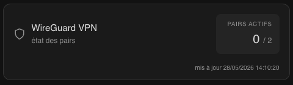
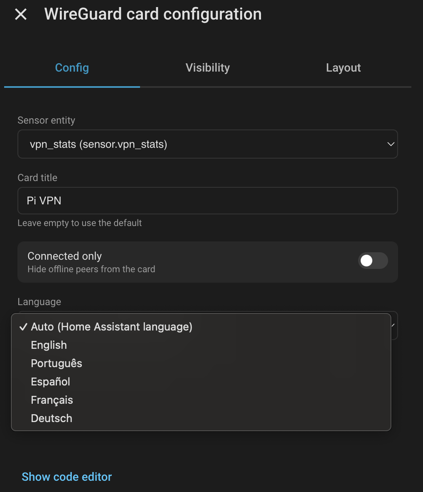

# Home Assistant Carte WireGuard

[English](README.md) · [Português](README.pt.md) · [Español](README.es.md) · **Français** · [Deutsch](README.de.md)

Une carte Lovelace épurée et minimaliste pour [Home Assistant](https://www.home-assistant.io/) qui affiche l'état des pairs WireGuard VPN — état de connexion, endpoints, statistiques de transfert et heure du dernier handshake — mise à jour en temps réel à partir d'un capteur REST.

---

## Aperçu




| Pair en ligne | Pair hors ligne |
|---|---|
| Point vert · badge `online` · handshake en secondes | Point gris · badge `offline` · handshake en heures |

Chaque carte de pair affiche :
- **État de connexion** — point et badge avec code couleur
- **Endpoint** — IP publique et port
- **IPs autorisées** — l'adresse du tunnel du pair
- **Dernier handshake** — au format lisible, surligné en vert lorsque le pair est en ligne
- **Statistiques de transfert** — rx / tx en unités lisibles

---

## Aucun YAML requis

La carte inclut un **éditeur visuel** intégré, vous pouvez donc la configurer directement depuis l'UI du tableau de bord — sans toucher au YAML. Depuis l'éditeur, vous pouvez modifier :

- **Entité du capteur** — choisissez l'entité `sensor.vpn_stats` qui alimente la carte
- **Titre de la carte** — remplacez le titre de l'en-tête, ou laissez vide pour utiliser la valeur par défaut localisée
- **Connectés uniquement** — activez pour masquer les pairs hors ligne
- **Langue** — forcez la langue de l'UI de la carte, ou laissez sur `Auto` pour suivre Home Assistant

### Éditeur visuel

La carte inclut un éditeur visuel, vous pouvez donc la configurer directement depuis l'UI du tableau de bord sans toucher au YAML :

- **Entité du capteur** — menu déroulant pour choisir l'entité `sensor.vpn_stats`
- **Titre de la carte** — champ de texte optionnel pour remplacer le titre de l'en-tête ; laissez vide pour utiliser la valeur par défaut localisée
- **Connectés uniquement** — interrupteur pour masquer les pairs hors ligne de la carte
- **Langue** — menu déroulant pour remplacer la langue de la carte ; par défaut `Auto (langue de Home Assistant)`
| 
### Langues

La carte traduit actuellement ses libellés dans les langues suivantes :

| Code | Langue |
|---|---|
| `en` | English (langue de repli par défaut) |
| `pt` | Português |
| `es` | Español |
| `fr` | Français |
| `de` | Deutsch |

Comportement :

- Si `language` est défini dans la configuration de la carte et correspond à l'un des codes ci-dessus, cette langue est utilisée.
- Sinon, la carte lit `hass.locale.language` (la langue de l'utilisateur Home Assistant). Les suffixes régionaux comme `pt-BR` ou `en-US` sont réduits à leur langue de base (`pt`, `en`).
- Si la langue résolue n'est pas dans la liste ci-dessus, la carte se rabat sur l'anglais.
- Le timestamp du pied est aussi formaté avec `toLocaleString(language)`, donc le format date/heure suit la langue résolue.

> Les chaînes `latest_handshake`, `transfer_rx_human` et `transfer_tx_human` proviennent de l'API telles quelles. Pour les obtenir dans votre langue, il faudra les localiser dans votre service `wg-stats.py` (ou équivalent).

---

## Prérequis

| Prérequis | Notes |
|---|---|
| Home Assistant | 2023.x ou supérieur |
| Un endpoint d'API WireGuard | Doit exposer le format JSON décrit ci-dessous — instructions d'installation plus bas |
| HACS | Nécessaire uniquement pour la méthode d'installation via HACS |

---

## Installation

### Option A — HACS (recommandé)

1. Ouvrez HACS dans la barre latérale de HA
2. Allez dans **Frontend**
3. Cliquez sur **⋮ → Dépôts personnalisés**
4. Ajoutez l'URL de ce dépôt et sélectionnez la catégorie **Lovelace**
5. Cliquez sur **Télécharger**
6. Faites un rafraîchissement forcé du navigateur (`Ctrl+Shift+R`)

### Option B — Manuel

1. Téléchargez `wireguard-card.js` depuis la [dernière version](../../releases/latest)
2. Copiez-le dans `/config/www/wireguard-card.js`
3. Allez dans **Paramètres → Tableaux de bord → ⋮ → Ressources → Ajouter une ressource**
   - URL : `/local/wireguard-card.js`
   - Type : `Module JavaScript`
4. Faites un rafraîchissement forcé du navigateur (`Ctrl+Shift+R`)

---

## API

Cette carte lit depuis un capteur REST qui interroge un endpoint JSON. L'endpoint doit retourner la structure suivante :

```json
{
  "active_peers": 1,
  "total_peers": 2,
  "peers": {
    "peer-name": {
      "friendly_name": "peer-name",
      "endpoint": "1.2.3.4:51820",
      "allowed_ips": "10.0.0.2/32",
      "latest_handshake": "21 seconds",
      "transfer_rx_human": "3.21 MiB",
      "transfer_tx_human": "137.18 MiB",
      "connected": true
    }
  },
  "updated_at": "2026-05-20T22:55:00.281068+00:00"
}
```

### Champs de premier niveau

| Champ | Requis | Notes |
|---|---|---|
| `peers` | ✅ | Objet indexé par nom de pair. La carte itère sur ses valeurs |
| `active_peers` | — | Affiché dans la statistique de l'en-tête. Se rabat sur l'état du capteur si omis |
| `total_peers` | — | Affiché à côté de `active_peers`. Se rabat sur le nombre d'entrées dans `peers` si omis |
| `updated_at` | — | Timestamp ISO affiché en pied. Le pied est masqué si omis |

### Champs par pair

| Champ | Requis | Notes |
|---|---|---|
| `friendly_name` | ✅ | Affiché comme le titre du pair |
| `endpoint` | ✅ | Affiché tel quel (p. ex. `1.2.3.4:51820`) |
| `allowed_ips` | ✅ | Affiché tel quel (p. ex. `10.0.0.2/32`) |
| `latest_handshake` | ✅ | Affiché tel quel, donc formatez-le comme vous voulez côté API |
| `transfer_rx_human` | ✅ | Affiché tel quel (p. ex. `3.21 MiB`) |
| `transfer_tx_human` | ✅ | Affiché tel quel (p. ex. `137.18 MiB`) |
| `connected` | ✅ | Booléen. Pilote l'indicateur en ligne/hors ligne et le filtre `connected_only` |

Tout champ supplémentaire que votre API renvoie (compteurs d'octets bruts, entiers « secondes passées », clés publiques, etc.) est simplement ignoré par la carte.


## Mise en place du service d'API de statistiques WireGuard

Suivez ces étapes pour configurer une simple API JSON pour l'état de WireGuard qui s'intègre à Home Assistant.

### 1. Créer le script de l'API

Créez le script de l'API avec votre éditeur préféré :

```bash
sudo nano /usr/local/bin/wg-stats.py
```

Vous trouverez un script d'exemple dans [`src/wg-stats.py`](src/wg-stats.py).  
Modifiez-le selon votre environnement.

### 2. Rendre le script exécutable

```bash
sudo chmod +x /usr/local/bin/wg-stats.py
```

### 3. Créer un service systemd

Configurez un service pour exécuter votre script automatiquement :

```bash
sudo nano /etc/systemd/system/wg-stats.service
```

Un exemple de [`wg-stats.service`](src/wg-stats.service) est disponible dans ce dépôt à titre de référence.  
Assurez-vous de mettre à jour `ExecStart` si votre chemin Python est différent.

### 4. Recharger systemd

Rechargez systemd pour qu'il détecte le nouveau service :

```bash
sudo systemctl daemon-reload
```

### 5. Activer le service au démarrage

Activez le service pour qu'il démarre au boot :

```bash
sudo systemctl enable wg-stats
```

### 6. Démarrer le service

Démarrez immédiatement le service de statistiques WireGuard :

```bash
sudo systemctl start wg-stats
```

### 7. Vérifier que tout fonctionne

Vérifiez l'état du service :

```bash
sudo systemctl status wg-stats
```

Vous devriez voir que le service est actif (en cours d'exécution).  
Si oui, votre endpoint d'API est prêt à être utilisé par Home Assistant.

> ⚠️ **Note de sécurité :** Le `wg-stats.py` d'exemple écoute sur `0.0.0.0:8888` **sans authentification ni TLS**, donc n'importe quel hôte du même réseau peut lire la topologie de votre WireGuard — noms des pairs, endpoints, IPs autorisées et statistiques de transfert. Avant de l'exposer, envisagez une ou plusieurs des options suivantes :
> - Liez-le à une interface spécifique (par exemple, changez l'adresse d'écoute de `0.0.0.0` vers `127.0.0.1` ou l'IP de votre seul LAN) afin qu'il ne soit pas accessible depuis des réseaux non fiables.
> - Restreignez l'accès avec une règle de pare-feu n'autorisant que votre hôte Home Assistant.
> - N'exposez jamais le port `8888` directement à internet. Si un accès distant est nécessaire, placez-le derrière un reverse proxy avec authentification/TLS, ou accédez-y via le VPN lui-même.

---

## Configuration du capteur

Ajoutez ce qui suit à votre `configuration.yaml` :

```yaml
sensor:
  - platform: rest
    name: vpn_stats
    unique_id: wireguard_vpn_stats
    resource: http://<votre-hôte-d-api>:<port>
    scan_interval: 10
    value_template: "{{ value_json.active_peers }}"
    unit_of_measurement: peers
    json_attributes:
      - active_peers
      - total_peers
      - peers
      - updated_at
```

Remplacez `<votre-hôte-d-api>:<port>` par l'adresse de votre API WireGuard.

| Champ | Description |
|---|---|
| `unique_id` | Permet la gestion de l'entité depuis l'UI |
| `scan_interval` | Fréquence de sondage en secondes — 10 est une valeur par défaut raisonnable |
| `value_template` | Définit l'état du capteur comme le nombre de pairs actifs |
| `unit_of_measurement` | Étiquette la valeur d'état dans l'historique et le journal |
| `json_attributes` | Extrait les données imbriquées comme attributs d'entité que la carte lit |

Après avoir édité `configuration.yaml`, rechargez votre configuration HA (**Outils développeur → YAML → Recharger tout le YAML**) ou redémarrez Home Assistant.

---

## Configuration de la carte

Ajoutez la carte à n'importe quel tableau de bord Lovelace :

```yaml
type: custom:wireguard-card
entity: sensor.vpn_stats
```

Lors de l'ajout de la carte depuis le sélecteur, la première entité `sensor.*` dont l'ID contient `vpn` est pré-sélectionnée — généralement `sensor.vpn_stats` — donc vous pouvez souvent valider sans rien changer.

### Options

| Option | Requis | Par défaut | Description |
|---|---|---|---|
| `entity` | ✅ | — | L'entité `sensor.vpn_stats` créée ci-dessus |
| `title` | — | _localisé_ `"WireGuard VPN"` | Texte personnalisé affiché comme titre de l'en-tête de la carte. Si omis, la valeur par défaut localisée est utilisée |
| `connected_only` | — | `false` | Lorsque `true`, masque les pairs dont le champ `connected` n'est pas `true`, ne laissant que ceux actuellement connectés |
| `language` | — | _langue de l'utilisateur Home Assistant_ | Force la langue de l'UI de la carte. Voir [Langues](#langues) pour les valeurs supportées. Si omis, la carte utilise la langue de l'utilisateur Home Assistant et se rabat sur l'anglais si non supportée |

Exemple avec un titre personnalisé, les pairs hors ligne masqués et l'UI forcée en portugais :

```yaml
type: custom:wireguard-card
entity: sensor.vpn_stats
title: VPN Maison
connected_only: true
language: pt
```

---

## Dépannage

**La carte affiche « Entity not found »**
→ Vérifiez que le capteur est chargé et que l'ID de l'entité correspond exactement (`sensor.vpn_stats` par défaut).

**Les pairs ne s'affichent pas**
→ Confirmez que `peers` figure dans `json_attributes` dans la configuration du capteur et que l'API renvoie bien un objet JSON valide sous cette clé.

**Les données sont périmées**
→ Vérifiez le timestamp `updated_at` affiché en bas de la carte. S'il ne se met pas à jour, vérifiez que l'API est joignable depuis HA et que `scan_interval` est défini.

**La carte n'apparaît pas dans le sélecteur de cartes**
→ Vérifiez que la ressource a bien été ajoutée et que vous avez fait un rafraîchissement forcé (`Ctrl+Shift+R`).

---

## Contribuer

Les pull requests sont les bienvenues. Veuillez ouvrir d'abord une issue pour les changements importants.
