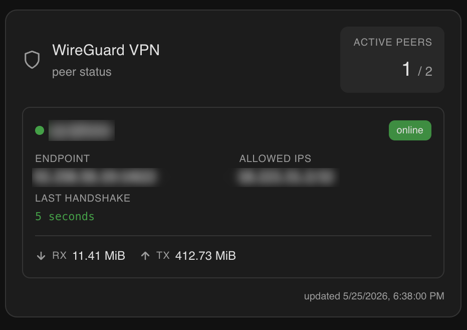
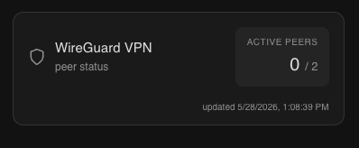

# Home Assistant WireGuard Card

**English** · [Português](README.pt.md) · [Español](README.es.md) · [Français](README.fr.md) · [Deutsch](README.de.md)

A clean, minimal Lovelace card for [Home Assistant](https://www.home-assistant.io/) that displays WireGuard VPN peer status — connection state, endpoints, transfer stats, and last handshake time — updated in real time from a REST sensor.

---

## Preview


| Online peer | Offline peer |
|---|---|
| Green dot · `online` badge · handshake in seconds | Grey dot · `offline` badge · handshake in hours |





Each peer card shows:
- **Connection status** — colour-coded dot and badge
- **Endpoint** — public IP and port
- **Allowed IPs** — the peer's tunnel address
- **Last handshake** — human-readable, highlighted green when the peer is online
- **Transfer stats** — rx / tx in human-readable units

---

## No YAML required

The card ships with a built-in **visual editor**, so you can set it up directly from the dashboard UI — no YAML editing needed. From the editor you can change:

- **Sensor entity** — pick the `sensor.vpn_stats` entity that feeds the card
- **Card title** — override the header title, or leave it empty for the localized default
- **Connected only** — toggle to hide offline peers
- **Language** — force the card's UI language, or leave it on `Auto` to follow Home Assistant

### Visual editor

The card ships with a visual editor, so you can configure it directly from the dashboard UI without touching YAML:

- **Sensor entity** — dropdown to pick the `sensor.vpn_stats` entity
- **Card title** — optional text input to override the header title; leave empty to use the localized default
- **Connected only** — toggle to hide offline peers from the card
- **Language** — dropdown to override the card's language; defaults to `Auto (Home Assistant language)`


### Languages

The card currently translates its labels into the following languages:

| Code | Language |
|---|---|
| `en` | English (default fallback) |
| `pt` | Português |
| `es` | Español |
| `fr` | Français |
| `de` | Deutsch |

Behaviour:

- If `language` is set in the card config and matches one of the codes above, that language is used.
- Otherwise, the card reads `hass.locale.language` (the user's Home Assistant language). Region suffixes like `pt-BR` or `en-US` are reduced to their base language (`pt`, `en`).
- If the resolved language is not in the list above, the card falls back to English.
- The footer timestamp is also formatted with `toLocaleString(language)`, so the date/time format follows the resolved language.

> The `latest_handshake`, `transfer_rx_human`, and `transfer_tx_human` strings come from the API as-is. To get them in your language you'll need to localise them in your `wg-stats.py` (or equivalent) service.

---

## Requirements

| Requirement | Notes |
|---|---|
| Home Assistant | 2023.x or later |
| A WireGuard API endpoint | Must expose the JSON format described below — setup instructions further down |
| HACS | Only needed for HACS install method |

---

## Installation

### Option A — HACS (recommended)

1. Open HACS in your HA sidebar
2. Go to **Frontend**
3. Click **⋮ → Custom repositories**
4. Add this repository URL and select category **Lovelace**
5. Click **Download**
6. Hard-refresh your browser (`Ctrl+Shift+R`)

### Option B — Manual

1. Download `wireguard-card.js` from the [latest release](../../releases/latest)
2. Copy it to `/config/www/wireguard-card.js`
3. Go to **Settings → Dashboards → ⋮ → Resources → Add resource**
   - URL: `/local/wireguard-card.js`
   - Type: `JavaScript module`
4. Hard-refresh your browser (`Ctrl+Shift+R`)

---

## API

This card reads from a REST sensor that polls a JSON endpoint. The endpoint must return the following structure:

```json
{
  "active_peers": 1,
  "total_peers": 2,
  "peers": {
    "peer-name": {
      "friendly_name": "peer-name",
      "endpoint": "1.2.3.4:51820",
      "allowed_ips": "10.0.0.2/32",
      "latest_handshake": "21 seconds",
      "transfer_rx_human": "3.21 MiB",
      "transfer_tx_human": "137.18 MiB",
      "connected": true
    }
  },
  "updated_at": "2026-05-20T22:55:00.281068+00:00"
}
```

### Top-level fields

| Field | Required | Notes |
|---|---|---|
| `peers` | ✅ | Object keyed by peer name. The card iterates over its values |
| `active_peers` | — | Shown in the header stat. Falls back to the sensor's state value if omitted |
| `total_peers` | — | Shown next to `active_peers`. Falls back to the number of entries in `peers` if omitted |
| `updated_at` | — | ISO timestamp shown in the footer. The footer is hidden if omitted |

### Per-peer fields

| Field | Required | Notes |
|---|---|---|
| `friendly_name` | ✅ | Displayed as the peer's title |
| `endpoint` | ✅ | Displayed as-is (e.g. `1.2.3.4:51820`) |
| `allowed_ips` | ✅ | Displayed as-is (e.g. `10.0.0.2/32`) |
| `latest_handshake` | ✅ | Displayed as-is, so format it however you prefer on the API side |
| `transfer_rx_human` | ✅ | Displayed as-is (e.g. `3.21 MiB`) |
| `transfer_tx_human` | ✅ | Displayed as-is (e.g. `137.18 MiB`) |
| `connected` | ✅ | Boolean. Drives the online/offline indicator and the `connected_only` filter |

Any extra fields your API returns (raw byte counters, seconds-ago integers, public keys, etc.) are simply ignored by the card.


## Setting up the WireGuard Stats API Service

Follow these steps to set up a simple JSON API for WireGuard status that integrates with Home Assistant.

### 1. Create the API Script

Create the API script using your preferred editor:

```bash
sudo nano /usr/local/bin/wg-stats.py
```

You can find a sample script at [`src/wg-stats.py`](src/wg-stats.py).  
Modify it as needed for your environment.

### 2. Make the Script Executable

```bash
sudo chmod +x /usr/local/bin/wg-stats.py
```

### 3. Create a systemd Service

Set up a service to run your script automatically:

```bash
sudo nano /etc/systemd/system/wg-stats.service
```

Example [`wg-stats.service`](src/wg-stats.service) available in this repository for reference.  
Be sure to update `ExecStart` if your Python path is different.

### 4. Reload systemd

Reload systemd so it detects the new service:

```bash
sudo systemctl daemon-reload
```

### 5. Enable the Service at Boot

Enable the service so that it runs on startup:

```bash
sudo systemctl enable wg-stats
```

### 6. Start the Service

Start the WireGuard stats service immediately:

```bash
sudo systemctl start wg-stats
```

### 7. Check That Everything Is Working

Verify the service status:

```bash
sudo systemctl status wg-stats
```

You should see that the service is active (running).  
If so, your API endpoint is now up and ready to be used by Home Assistant.

> ⚠️ **Security note:** The sample `wg-stats.py` listens on `0.0.0.0:8888` with **no authentication and no TLS**, so any host on the same network can read your WireGuard topology — peer names, endpoints, allowed IPs, and transfer stats. Before exposing it, consider one or more of the following:
> - Bind to a specific interface (e.g. change the listen address from `0.0.0.0` to `127.0.0.1` or your LAN-only IP) so it isn't reachable from untrusted networks.
> - Restrict access with a firewall rule allowing only your Home Assistant host.
> - Never expose port `8888` directly to the internet. If remote access is needed, put it behind a reverse proxy with authentication/TLS, or reach it over the VPN itself.

---

## Sensor configuration

Add the following to your `configuration.yaml`:

```yaml
sensor:
  - platform: rest
    name: vpn_stats
    unique_id: wireguard_vpn_stats
    resource: http://<your-api-host>:<port>
    scan_interval: 10
    value_template: "{{ value_json.active_peers }}"
    unit_of_measurement: peers
    json_attributes:
      - active_peers
      - total_peers
      - peers
      - updated_at
```

Replace `<your-api-host>:<port>` with the address of your WireGuard API.

| Field | Description |
|---|---|
| `unique_id` | Enables entity management from the UI |
| `scan_interval` | Poll frequency in seconds — 10 is a sensible default |
| `value_template` | Sets the sensor state to the active peer count |
| `unit_of_measurement` | Labels the state value in history and logbook |
| `json_attributes` | Pulls nested data into entity attributes for the card to read |

After editing `configuration.yaml`, reload your HA configuration (**Developer Tools → YAML → Reload all YAML**) or restart Home Assistant.

---

## Card configuration

Add the card to any Lovelace dashboard:

```yaml
type: custom:wireguard-card
entity: sensor.vpn_stats
```

When adding the card from the dashboard picker, the first `sensor.*` entity whose ID contains `vpn` is pre-selected — usually `sensor.vpn_stats` — so you can often confirm without changing anything.

### Options

| Option | Required | Default | Description |
|---|---|---|---|
| `entity` | ✅ | — | The `sensor.vpn_stats` entity created above |
| `title` | — | _localized_ `"WireGuard VPN"` | Custom text shown as the card header title. If omitted, the localized default is used |
| `connected_only` | — | `false` | When `true`, hides peers whose `connected` field is not `true`, leaving only currently connected ones |
| `language` | — | _Home Assistant's user language_ | Forces the card UI language. See [Languages](#languages) for supported values. If omitted, the card uses Home Assistant's user language and falls back to English if unsupported |

Example with a custom title, offline peers hidden, and the UI forced to Portuguese:

```yaml
type: custom:wireguard-card
entity: sensor.vpn_stats
title: Home VPN
connected_only: true
language: pt
```

---

## Troubleshooting

**Card shows "Entity not found"**
→ Check that the sensor is loaded and the entity ID matches exactly (`sensor.vpn_stats` by default).

**Peers not showing**
→ Confirm `peers` is listed under `json_attributes` in the sensor config and the API is returning a valid JSON object under that key.

**Data is stale**
→ Check the `updated_at` timestamp shown at the bottom of the card. If it's not updating, verify the API is reachable from HA and `scan_interval` is set.

**Card not appearing in the card picker**
→ Make sure the resource was added correctly and you've done a hard refresh (`Ctrl+Shift+R`).

---

## Contributing

Pull requests are welcome. Please open an issue first for significant changes.